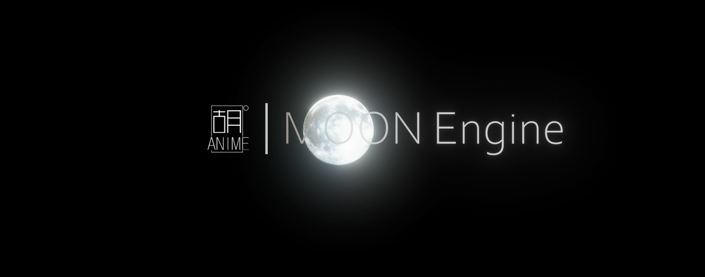

# MoonEngine
A toy DCC software implemented based on OpenGL and imgui

<p align="center">
    
</p>


## Feature List
- import and view .OBJ mesh
- basic viewport interaction
- <strong>RABBIT RENDERER: </strong> a basic raytracing renderer
- <strong>MOON NN: </strong> node based interactive neural network training platform


## Quick tutorial
### viewport hotkeys
|operation                  |hotkey             |
|:-                         |:-:                |
|Gizmo::Move                |w                  |
|Gizmo::Rotate              |e                  |
|Gizmo::Scale               |r                  |
|Camera::Pan                |middle mouse       |
|Camera::Zoom               |mouse wheel        |
|Camera::Rotate             |alt + middle mouse |
|Selecting Object           |left click         |
|Select multiple Object     |ctrl + left click  |
|Centering Selected Object  |z                  |
|Flow Menu                  |right click        |
|Open Material Editor       |m                  |

### load OBJ model
```
auto boxes = MOON_ModelManager::LoadModel("Assets\\Models\\box_stack.obj");
```

### transform an object
```
boxes->transform.Translate(Vector3(0.0f, 1.0f, 0.0f), LOCAL);
boxes->transform.Rotate(Quaternion(Vector3(90.0f, 0, 0)), WORLD);
boxes->transform.Scale(Vector3(0.2f, 0.2f, 0.2f));
```

### create a material
```
auto newMat = MaterialManager::CreateMaterial("MoonMtl", "new_mat");
```

### assign material to mesh
```
// a model may contain multiple sub-meshes
// each mesh corresponds to a material
boxes->meshList[0].material = newMat;
```

### raytracing current viewport
```
Renderer::StartRendering();
```

### abort rendering
```
Renderer::isAbort = true;
```

### create an nn via script
```
// graph: a container to hold all created neurons
auto graph = new NGraph("newGraph");

// n-dimensional input vector, not participating in training
// input_size: dimension of input feature
auto feature = new NVariable(Vector2(input_size, 1), graph, false, false);

// m-dimensional output vector, not participating in training
// output_size: dimension of input feature
auto label = new NVariable(Vector2(output_size, 1), graph, false, false);

// construct full connection layer
// y = wx+b
// hsize: number of neuron
auto output = new NAdd({
    new NMatMul({
        new NVariable(Vector2(hsize, input_size), graph, true),
        feature
    }, graph),
    new NVariable(Vector2(hsize, 1), graph, true)
}, graph);
                
// activation function
output = ReLU(output, graph);

// output neural node
auto predict = new NAdd({
    new NMatMul({
        new NVariable(Vector2(output_size, input_size), graph, true),
        input_vec
    }, graph),
    new NVariable(Vector2(output_size, 1), graph, true)
}, graph);

// loss function
auto loss = MSE({predict, label}, graph);

// optimizer
auto opt = Adam(graph, loss);
```

### do one step training
```
// set input feature
feature->SetVal(...);

// set label for calculate loss
label->SetVal(...);

// calculate predict vector based on input feature
opt->Forward();

// calculate gradient map
opt->Backward();

// update weight and bias
opt->Update();

// clear gradient map
opt->ClearGrad();
```


## Video links
:full_moon: [MOON ENGINE](https://www.bilibili.com/video/BV1iK4y1C7h7)

:new_moon: [MOON NN](https://www.bilibili.com/video/BV1GT4y137kx)


## Screen shots
<p align="center">
    
</p>
<p align="center">
    
</p>
<p align="center">
    
</p>
