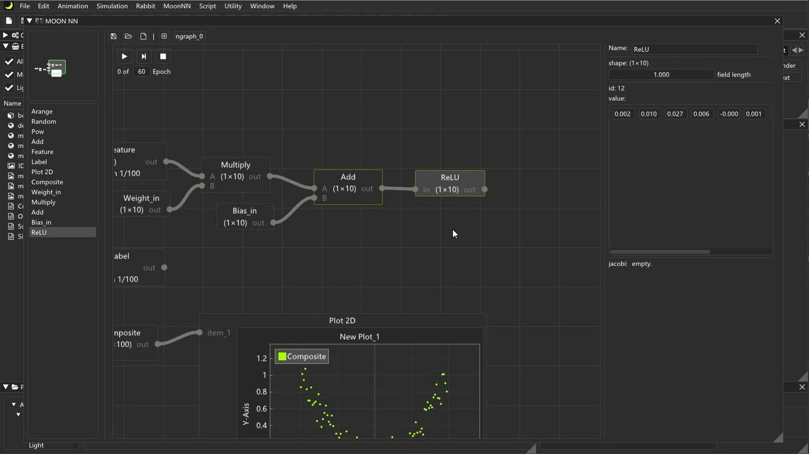

# MoonEngine
A toy DCC software implemented based on OpenGL and imgui

<p align="center">
    
</p>


## Feature List
- PBR viewport / HDRI IBL
- Split view / Multiple display mode
- Interactive mesh creation
- Hierarcial transform
- Import and view .OBJ mesh
- Basic viewport interaction
- SEM Shader (ZBRush style outlook)
- Post-Processing supported
- Operation stack (Something like the modifiers in 3ds Max)
- Volume rendering supported
- Procedural texture generation
- <strong>RABBIT RENDERER: </strong> a basic raytracing renderer
- <strong>MOON CAKE: </strong> procedural modeling tools
- <strong>MOON NN: </strong> node based interactive neural network training platform


## Quick tutorial
### viewport hotkeys
|Operation                  |Hotkey             |
|:-                         |:-:                |
|Gizmo::Move                |w                  |
|Gizmo::Rotate              |e                  |
|Gizmo::Scale               |r                  |
|Camera::Pan                |middle mouse (hold)|
|Camera::Zoom               |mouse wheel        |
|Camera::Rotate             |alt + middle mouse |
|Select Object              |left click         |
|Delete Object              |delete             |
|Select Multiple Object     |ctrl + left click  |
|Centering Selected Object  |z                  |
|Flow Menu                  |right click (hold) |
|Open Material Editor       |m                  |
|Open MOON NN Editor        |n                  |
|Search Node                |s                  |
|Change Shading Mode        |F1-F4              |
|Switch Split/Single View   |space              |

### Load OBJ model
```
auto boxes = MOON_ModelManager::LoadModel("Assets\\Models\\box_stack.obj");
```

### Transform an object
```
boxes->transform.Translate(Vector3(0.0f, 1.0f, 0.0f), LOCAL);
boxes->transform.Rotate(Quaternion(Vector3(90.0f, 0, 0)), WORLD);
boxes->transform.Scale(Vector3(0.2f, 0.2f, 0.2f));
```

### Create SmartMesh
```
Model* sphere = MOON_ModelManager::CreateSmartMesh(SmartMesh::sphere, "sphere");
```

### Set parent
```
boxes->transform.SetParent(&sphere->transform);
```

### Create Light
```
auto light = MOON_LightManager::CreateLight(point_light, "pointLight", Vector3(-10.0f, 10.0f, 10.0f));
```

### Create Volume object
```
auto cloud = MOON_VolumeManager::CreateVolume(
	"cloud", false, Vector3::ZERO(), 
	Vector3::ONE() * -5, Vector3::ONE() * 5
);
```

### Create a material
```
auto newMat = MaterialManager::CreateMaterial("MoonMtl", "new_mat");
```

### Assign material to mesh
```
// a model may contain multiple sub-meshes
// *each mesh corresponds to a material
boxes->meshList[0].material = newMat;
```

### Add post effect to stack
```
Graphics::postStack.push_back(new FXAA());
Graphics::postStack.push_back(new DepthOfField());
```

### Raytracing current viewport
```
Renderer::StartRendering();
```

### Abort rendering
```
Renderer::isAbort = true;
```

### Create an nn via script
```
// graph: a container to hold all created neurons
auto graph = new NGraph("newGraph");

// n-dimensional input vector, not participating in training
// input_size: dimension of input feature
auto feature = new NVariable(Vector2(input_size, 1), graph, false, false);

// m-dimensional output vector, not participating in training
// output_size: dimension of input feature
auto label = new NVariable(Vector2(output_size, 1), graph, false, false);

// construct full connection layer
// y = wx+b
// hsize: number of neuron
auto output = new NAdd({
    new NMatMul({
        new NVariable(Vector2(hsize, input_size), graph, true),
        feature
    }, graph),
    new NVariable(Vector2(hsize, 1), graph, true)
}, graph);
                
// activation function
output = ReLU(output, graph);

// output neural node
auto predict = new NAdd({
    new NMatMul({
        new NVariable(Vector2(output_size, input_size), graph, true),
        input_vec
    }, graph),
    new NVariable(Vector2(output_size, 1), graph, true)
}, graph);

// loss function
auto loss = MSE({predict, label}, graph);

// optimizer
auto opt = Adam(graph, loss);
```

### Do one step training
```
// set input feature
feature->SetVal(...);

// set label for calculate loss
label->SetVal(...);

// calculate predict vector based on input feature
opt->Forward();

// calculate gradient map
opt->Backward();

// update weight and bias
opt->Update();

// clear gradient map
opt->ClearGrad();
```


## Video links
:full_moon: MOON ENGINE v0.20：[Youtube](https://youtu.be/y4HRC0XTYNI)/[Bilibili](https://www.bilibili.com/video/BV1Ti4y1j7Bd)

:full_moon: [MOON ENGINE v0.03](https://www.bilibili.com/video/BV1iK4y1C7h7)

:new_moon: [MOON NN](https://www.bilibili.com/video/BV1GT4y137kx)


## Screen shots
<p align="center">
    
</p>
<p align="center">
    
</p>
<p align="center">
    
</p>
<p align="center">
    
</p>
<p align="center">
    
</p>
<p align="center">
    
</p>
<p align="center">
    
</p>
<p align="center">
    
</p>
<p align="center">
    
</p>
